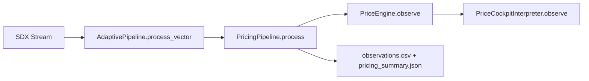

# SADE Pricing Pipeline Design V0.1 (2026-08-25)

## Mission
Build, document, migrate, and validate a SADE-owned pricing pipeline from validated APTF price-side code while preserving mathematics and behavior.

## Scope Boundaries
- In scope: price-side derivatives, F4 fitting, RK45 one-step projection, numerical contract row, price engine policy emission, cockpit interpretation, integrated adaptive->pricing unit run entrypoint.
- Out of scope: volume path, execution synthesis, order placement, portfolio management.

## Causal Topology
SDX is consumed once by adaptive. Pricing consumes only adaptive output records.

## Required Seam Availability Matrix

| Field | Source Module | Required by Pricing | Enforced |
|---|---|---:|---|
| entity_id | sade.adaptive_pipeline.pipeline | Yes | ValueError ENTITY_MISMATCH |
| source_row_index | sade.adaptive_pipeline.pipeline | Yes | ValueError SOURCE_ORDER_REGRESSION |
| source_timestamp | sade.adaptive_pipeline.pipeline | Yes | ValueError MISSING_ADAPTIVE_FIELD |
| open | sade.adaptive_pipeline.pipeline | Yes | ValueError MISSING_ADAPTIVE_FIELD |
| high | sade.adaptive_pipeline.pipeline | Yes | ValueError MISSING_ADAPTIVE_FIELD |
| low | sade.adaptive_pipeline.pipeline | Yes | ValueError MISSING_ADAPTIVE_FIELD |
| close | sade.adaptive_pipeline.pipeline | Yes | ValueError MISSING_ADAPTIVE_FIELD |
| volume | sade.adaptive_pipeline.pipeline | Yes | ValueError MISSING_ADAPTIVE_FIELD |
| session_type | sade.adaptive_pipeline.pipeline | Optional fallback | Default UNKNOWN |
| source_provider | sade.adaptive_pipeline.pipeline | Optional fallback | Default SDX |

## Source-To-Target Migration Matrix

| APTF Source Authority | SADE Target |
|---|---|
| diagnostics/run_test_009_derivative_analysis.py::causal_quadratic | sade/pricing_pipeline/derivatives.py::causal_quadratic |
| diagnostics/run_test_013b_qqq_validation.py::fit_f4 | sade/pricing_pipeline/dynamics.py::fit_f4 |
| diagnostics/run_test_013b_qqq_validation.py::solve_cover | sade/pricing_pipeline/projection.py::solve_cover |
| diagnostics/run_test_014_policy_development.py::build_numerical | sade/pricing_pipeline/numerical.py::build_numerical_row |
| price_engine/contracts.py | sade/pricing_pipeline/price_engine/contracts.py |
| price_engine/policy.py | sade/pricing_pipeline/price_engine/policy.py |
| price_engine/engine.py | sade/pricing_pipeline/price_engine/engine.py |
| price_engine/cockpit.py | sade/pricing_pipeline/price_engine/cockpit.py |

## Determinism And Provenance Decisions
- Mathematical kernels remain equivalent and are validated by test-based parity against APTF modules.
- Pricing runtime does not import APTF modules.
- Timestamp values are preserved; no normalization layer is introduced.
- No cadence repair logic is added.
- One-step causal lag is explicit for F4/RK compatibility: projection is emitted for the latest fully-formed index.

## Validation Contract
- Package tests: pricing behavior and contract failures.
- Migration equivalence tests: derivative/F4/RK/numerical/engine/cockpit parity against APTF authority modules.
- Integrated run: SADE PRICING UNIT RUN 001 writes observations + summary + migration marker.

## Documentation Audit Table

| Deliverable | Path | Status |
|---|---|---|
| Design | docs/design/SADE_PRICING_PIPELINE_DESIGN_V0_1_2026-08-25.md | Complete |
| Implementation | docs/implementations/SADE_PRICING_PIPELINE_V0_1_IMPLEMENTATION_2026-08-25.md | Complete |
| Run report | docs/runs/SADE_PRICING_UNIT_RUN_001_AAPL_100_2026-08-25.md | Complete |
| Machine summary | output/unit_runs/pricing_001/pricing_summary.json | Produced |
| Equivalence marker | output/unit_runs/pricing_001/migration_equivalence.json | Produced |
| Observation table | output/unit_runs/pricing_001/observations.csv | Produced |

## Acceptance Criteria A-Z Checklist
- A. SADE-owned pricing package exists: PASS
- B. Adaptive seam consumed as input: PASS
- C. No second SDX stream in pricing: PASS
- D. Required seam fields enforced: PASS
- E. Entity coherence enforced: PASS
- F. Row-order monotonicity enforced: PASS
- G. Derivative kernel migrated: PASS
- H. F4 fit kernel migrated: PASS
- I. RK45 projection migrated: PASS
- J. Numerical row builder migrated: PASS
- K. Price engine contracts migrated: PASS
- L. Price emission policy migrated: PASS
- M. Cockpit interpreter migrated: PASS
- N. Runtime APTF dependency in pricing package: PASS (none)
- O. Equivalence tests implemented: PASS
- P. Package tests implemented: PASS
- Q. Tests executed successfully: PASS
- R. Integrated run command implemented: PASS
- S. Integrated run artifact writer implemented: PASS
- T. APTF open/load audit in run implemented: PASS
- U. APTF module-load count on run: PASS (0 in current run)
- V. APTF file-open count on run: PASS (0 in current run)
- W. Unit run with live SDX connectivity: PASS
- X. Scientific behavior freeze statement present: PASS
- Y. Migration evidence hashes documented: PASS
- Z. Integrity conclusion documented: PASS

## Integrity Statement
The SADE pricing package is implemented and validated for mathematical and behavioral parity with APTF source authority, and live integrated runtime validation completed successfully for AAPL/100.
